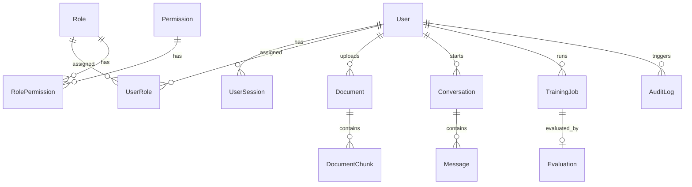
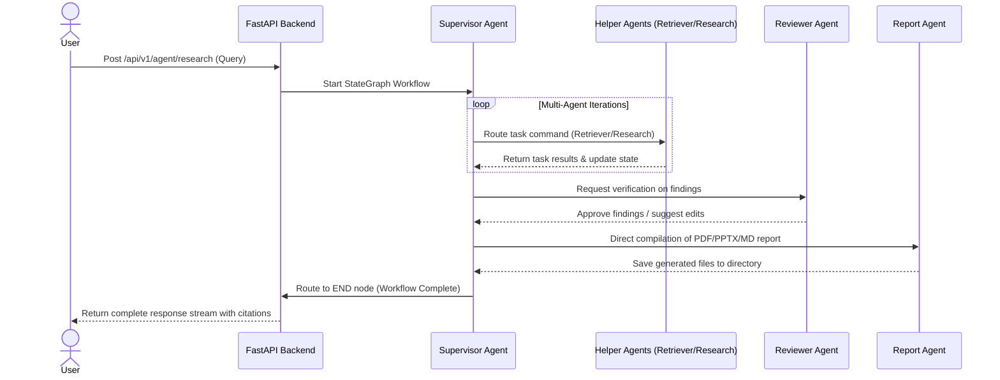

# Hermes: Enterprise AI Document Intelligence Platform

Designed and built as a production-ready, multi-agent AI research and retrieval platform featuring LangGraph orchestration, hybrid vector/keyword retrieval, QLoRA fine-tuning, MLflow experiment tracking, Docker Compose development, and Prometheus monitoring.

---

## 🏗️ Architecture

```
                  ┌─────────────────┐
                  │   Next.js UI    │ (Port 3000)
                  └────────┬────────┘
                           │ HTTP / Event Stream
                           ▼
                  ┌─────────────────┐
                  │   FastAPI API   │ (Port 8000)
                  └────────┬────────┘
                           │
             ┌─────────────┼─────────────┐
             ▼             ▼             ▼
      ┌────────────┐ ┌────────────┐ ┌────────────┐
      │ PostgreSQL │ │   Redis    │ │  RabbitMQ  │
      │   (SQL)    │ │(Cache/Task)│ │(Event Bus) │
      └────────────┘ └────────────┘ └────────────┘
                           ▲             ▲
                           │             │
                           └──────┬──────┘
                                  │
                                  ▼
                         ┌──────────────────┐
                         │  Celery Workers  │ (Background Tasks)
                         └────────┬─────────┘
                                  │
                   ┌──────────────┼──────────────┐
                   ▼              ▼              ▼
             ┌──────────┐   ┌──────────┐   ┌──────────┐
             │  Qdrant  │   │  MLflow  │   │  vLLM/HF │
             │ (Vector) │   │ (Models) │   │ (Models) │
             └──────────┘   └──────────┘   └──────────┘
```

---

## 🛠️ Tech Stack

- **Frontend**: Next.js 15, TypeScript, TailwindCSS, shadcn/ui
- **Backend API**: FastAPI, SQLAlchemy 2.0 (Asyncpg), Celery, Redis, RabbitMQ
- **AI / LLM Orchestration**: LangGraph, LangChain Core, HuggingFace Transformers, PEFT, TRL, QLoRA
- **Vector Search**: Qdrant, SentenceTransformers, BM25, CrossEncoder Re-ranking
- **MLOps & Observability**: MLflow, Prometheus, Grafana, Jaeger (OpenTelemetry)
- **DevOps**: Docker, Docker Compose, Kubernetes

---

## 📂 Folder Structure

```
hermes/
├── backend/          # FastAPI application server and routers
│   └── core/         # Core application configurations, logging, security
├── frontend/         # Next.js UI typescript application
├── agents/           # LangGraph supervisor and domain-specific agents
├── tools/            # Actions tools (Python, SQL query executor, report builders)
├── rag/              # OCR, chunking, indexing, and hybrid retrieval logic
├── finetuning/       # QLoRA instruction dataset and fine-tuning pipelines
├── evaluation/       # Performance evaluation loops (RAGAS, BERTScore, ROUGE)
├── monitoring/       # Monitoring config (Prometheus scrapers, Grafana dashboards)
├── deployment/       # Kubernetes manifests (deployments, service meshes)
├── tests/            # Test suites (unit, integration, failure, and performance)
├── docs/             # Technical specifications and document guides
├── docker-compose.yml
├── pyproject.toml
└── README.md
```

---

## 🚀 Quick Start (Local Development)

### Prerequisites

- **Python**: `>=3.12` (Python 3.13 recommended)
- **Node.js**: `>=20` (Node.js v24 recommended)
- **Docker**: Engine version `>=25.0` with Docker Compose

### 1. Initialize Python Environment
Using `uv` package manager (pre-installed):
```bash
# Sync dependencies and build virtual environment
py -3.13 -m uv sync

# Activate virtual environment
.venv\Scripts\activate
```

### 2. Configure Environment variables
Copy the environment variables template and configure your keys:
```bash
copy .env.example .env
```
Ensure to add your `OPENAI_API_KEY` to `.env` for agent models.

### 3. Run Development Infrastructure
Launch external dependencies via Docker Compose:
```bash
docker compose up -d postgres redis rabbitmq qdrant mlflow jaeger prometheus grafana
```

### 4. Run Services locally

**Start Backend API**:
```bash
uvicorn backend.main:app --reload --host 127.0.0.1 --port 8000
```

**Start Celery Worker**:
```bash
celery -A backend.celery_worker.celery_app worker --loglevel=info
```

**Start Frontend Client**:
```bash
cd frontend
npm run dev
```

---

## 🧪 Quality Control & Testing

We enforce strict formatting, linting, and typing checks:

```bash
# Code Formatting (Black)
py -3.13 -m uv run black .

# Linting & Formatting Check (Ruff)
py -3.13 -m uv run ruff check .

# Strict Type Checking (MyPy)
py -3.13 -m uv run mypy .

# Run Test Suite
py -3.13 -m uv run pytest

# Run Test Suite with Coverage
py -3.13 -m uv run pytest --cov=backend --cov=agents --cov=finetuning --cov-report=term
```

### ⚡ Load Testing (Locust)
Locust has been added to test target endpoint capacities. To run concurrent load test simulations:
```bash
# Start headless load test for 30s with 10 users
py -3.13 -m uv run locust -f tests/load/locustfile.py --headless -u 10 -r 2 -t 30s --host http://localhost:8000
```

---

## 💾 Database Entity Relationship Diagram (ERD)

The relational schema is configured in PostgreSQL/SQLite:



---

## 🤖 Multi-Agent Workflow Sequence Map

The hub-and-spoke multi-agent workgroup runs via LangGraph:



---

## ☸️ Kubernetes Deployment Guide

Deployment files supporting HPAs and scaling reside in `k8s/`.

### Prerequisites
- Active Kubernetes cluster (e.g. Minikube or cloud provider).
- Active Ingress Controller (e.g. NGINX Ingress Controller).

### Deployment Steps
```bash
# 1. Create hermes namespace
kubectl apply -f k8s/namespace.yaml

# 2. Deploy ConfigMaps and Secret variables
kubectl apply -f k8s/configs.yaml

# 3. Deploy databases layer (Postgres, Redis, RabbitMQ, Qdrant)
kubectl apply -f k8s/databases.yaml

# 4. Deploy backend, celery worker, and frontend services
kubectl apply -f k8s/backend.yaml
kubectl apply -f k8s/celery-worker.yaml
kubectl apply -f k8s/frontend.yaml

# 5. Deploy Ingress router controller
kubectl apply -f k8s/ingress.yaml
```

To monitor running services:
```bash
# Check running pods status
kubectl get pods -n hermes

# Check active autoscaling replicas
kubectl get hpa -n hermes
```

